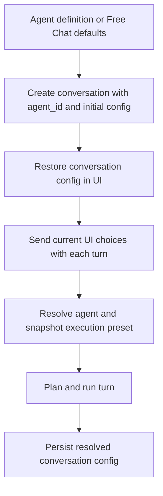
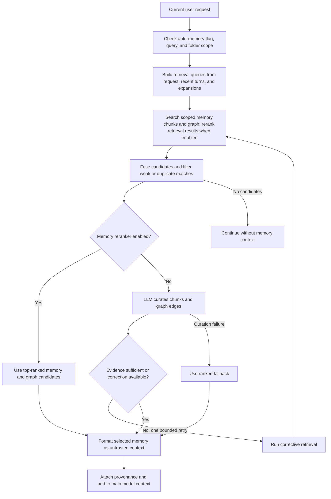
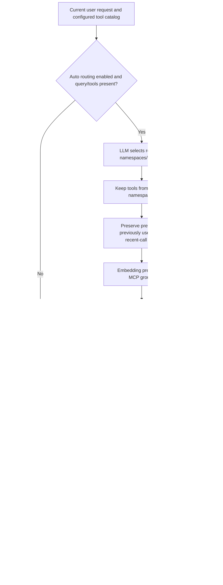
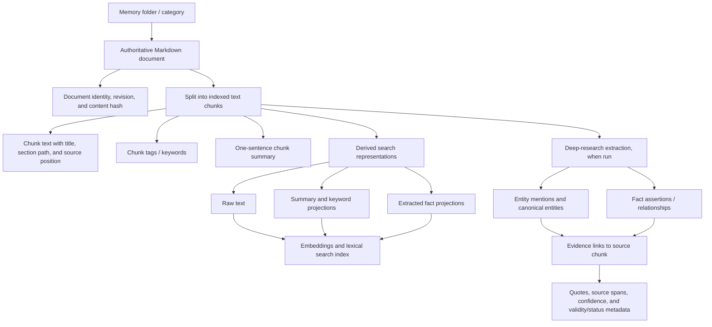

# Agent and chat execution flows

**Verified against the code on Sept 26, 2026.**

## Agent-backed chats and configuration snapshots

An agent is a reusable starting preset. Creating a conversation records its `agent_id` and initializes `execution_config_json` from the agent definition (model/provider, tools, subagents, prompt, reasoning and routing flags, and assigned memory folders). Free Chat uses the same conversation machinery with no agent ID and a default free-chat configuration.

The web UI loads the conversation's agent, then restores its conversation-specific execution config. On each send it passes the current UI choices in the run request. The server resolves the conversation's agent and builds an `ExecutionPreset` snapshot for that execution: configured tool keys and subagent assignments are copied, while per-chat choices such as model/provider, system prompt, auto-tool routing, and auto-memory are applied as overrides. The run therefore uses the submitted configuration even if the reusable agent definition is edited later; edits to the agent definition do not rewrite an existing conversation's saved config.

After planning/resolving the model, the server persists the effective conversation config, including resolved provider/model, so reopening the conversation restores its settings. Tools actually used by routing may also be persisted as sticky allowed tools for follow-up turns. The user can keep overrides scoped to the chat, reset them to the agent baseline, or explicitly apply them to the reusable agent. Free Chat has its own captured preset for UI choices.

## Auto memory router

Memory routing runs during pre-execution when auto memory is enabled and there is a text query. An explicit empty memory-folder selection suppresses retrieval; otherwise the selected/assigned folder scope and the agent identity constrain memory search. Free Chat has no agent-specific memory identity.

The router combines the current request with a short recent-conversation context and any planned query expansions. It retrieves memory and source-grounded knowledge-graph candidates, fuses and filters results, then selects context. Depending on configuration, selection uses the memory reranker or a small LLM curation call. The curation step can reject weakly related evidence and request one bounded corrective retrieval. If curation is unavailable, ranked results are used as fallback. Selected evidence is inserted into the main model context as marked, untrusted retrieved context, with provenance attached for the UI. If the router fails, the turn continues without injected memory.

## Auto tool router

When enabled, and the turn has a text query and configured tools, routing first asks a small LLM selector which tool namespaces/toolsets are needed (up to the router's namespace limit). It then filters to those namespaces and routes individual tools using embeddings and relevance ranking; lexical matching is the fallback if embedding/routing fails. Small selected namespaces may be included whole within size limits. Explicitly preferred tools, tools already used, and tools referenced by recent tool calls are preserved. A runtime tool-search/expansion tool remains available to discover additional MCP capabilities.

The resulting tool list is passed to the main assistant execution. Routing chooses which tools are exposed for the turn; tool approval policy still applies when the assistant calls them. With routing disabled, the configured/static tool policy is used instead.

## Subagent sessions and continuation

Subagents are delegated tool runs, not separate user-facing conversations. The orchestrator can spawn only agents assigned to it. `spawn_subagent` creates a unique invocation ID and a private transcript containing the supplied task/context (and optionally a referenced attachment); it does not automatically copy the parent transcript. The subagent runs with its own model, prompt, tools, memory settings, and bounded execution/round limits.

**A subagent can be continued.** The orchestrator calls `continue_subagent` with the returned invocation ID and a follow-up. The server loads the saved private transcript for that invocation and conversation, appends the new follow-up, and runs the same subagent again. Successful runs update that transcript, so the next continuation sees the earlier delegated exchanges. Continuation is scoped to the parent conversation and succeeds only while the original agent remains assigned and available. It does not resume an interrupted in-memory executor; it starts another executor from the durable transcript. The parent can pass new context explicitly.

## Image, video, and audio in chat

These capabilities use the same conversation, message history, and chat send endpoint; they are not separate conversation types. A user can attach supported image/audio inputs to ordinary turns, and generated media is saved as conversation artifacts and rendered in the chat transcript. Provider/model capabilities decide which execution path handles a turn.

- **Image input:** attached images are included in the current user message for models that accept image input.
- **Image output:** when the selected model is identified as a dedicated image-generation model, the send handler calls the image-generation API path and saves returned images as artifacts. A follow-up after a generated image can include that image as an edit reference.
- **Video output:** a model advertising video output uses the video-generation API path. Optional attached images can be supplied as frame/reference images; returned video is saved as an artifact.
- **Audio input/transcription:** attached audio is sent as audio content to a model that accepts audio input. Selecting a transcription-output model instead invokes the dedicated transcription path and requires an audio attachment. Voice recording in the browser also has a local Whisper speech-to-text path that transcribes into the composer.

Thus image/video generation and dedicated transcription are specialized branches inside the normal chat send flow. Ordinary multimodal input remains part of the main model turn. The exact path depends on the selected model's advertised modalities and provider support; a model that does not support an attachment modality is surfaced as unsupported by the UI/provider path.

## What a memory document contains

The saved Markdown file is the source of truth. A memory folder (the UI's category/scope) organizes the document and limits which agents or chats can retrieve it. Indexing produces chunk-level metadata and derived search structures. Deep-research extraction can also build a source-grounded knowledge graph; those extracted records keep links back to the supporting chunk so they can be checked against the Markdown.

The document-level file index can also hold aggregate tags and indexing timestamps/status. Chunk summaries and tags are generated per source chunk. Entity mentions and fact/relationship assertions are optional extracted knowledge, not edits to the Markdown; their evidence records point back to a supporting chunk and preserve a quote/span. Search projections and embeddings are rebuildable indexes, while the Markdown and its revision history remain authoritative.

## Code landmarks

- Conversation initialization and saved config: `apps/server/src/routes/conversations.ts`, `apps/server/src/core/chat/run-config.ts`
- UI overrides/restoration and send payload: `apps/web/src/composables/useChatAgentConfig.ts`, `apps/web/src/composables/useChatMessages.ts`
- Per-turn snapshot/planning: `apps/server/src/core/agent/execution-preset.ts`, `apps/server/src/core/agent/pre-execution/execution-planner.ts`
- Memory/tool routing: `apps/server/src/core/agent/pre-execution/auto-memory-routing.ts`, `apps/server/src/core/agent/pre-execution/auto-tool-routing.ts`, `apps/server/src/core/agent/tool-router.ts`
- Memory document and knowledge graph: `apps/server/src/core/memory/rag.ts`, `apps/server/src/core/memory/deep-research-extractor.ts`, `apps/server/src/core/memory/memory-knowledge.ts`, `apps/server/src/db/schema.ts`
- Subagent spawn/continue: `apps/server/src/core/agent/sub-agent-tools.ts`
- Media dispatch and execution: `apps/server/src/routes/chat.ts`, `apps/server/src/core/chat/media-execution.ts`, `apps/web/src/composables/useWhisper.ts`
