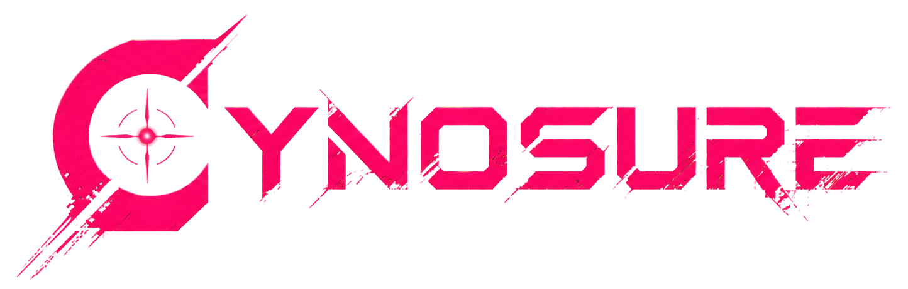

<p align="center">
  
</p>

<p align="center">
  A personal AI workspace for conversations, capable agents, and lasting memory.
</p>

<p align="center">
  <a href="https://cynosure-ai.github.io">Project site</a>
</p>

---

Cynosure brings AI chat, configurable agents, tools, and personal knowledge together in one workspace. Choose the language model that suits a task, give an agent access to the tools and memory it needs, and keep the resulting work in a searchable conversation history.

Run Cynosure as a web app on your own machine or package it as a desktop app. You connect your own model provider or local model; Cynosure is the interface and orchestration layer around them.

## What you can do

- **Chat with different models.** Connect providers such as OpenAI, Anthropic, Google Gemini, or local runtimes including Ollama, LM Studio, and Unsloth Studio. Stream responses and work with supported image, file, and audio inputs.
- **Create agents for recurring work.** Set an agent's instructions, model, tools, and memory access. Use specialist sub-agents for delegated tasks.
- **Give agents useful tools.** Combine built-in tools with Model Context Protocol (MCP) servers. Review or approve tool use with configurable human approval controls.
- **Keep a searchable knowledge base.** Organize notes in memory folders and let agents retrieve relevant passages during a conversation. Markdown source files remain the source of truth; search indexes can be rebuilt.
- **Connect conversations to your workflows.** Set up Telegram, Discord, or Slack channels, and schedule recurring or one-time agent tasks.
- **Keep control of where it runs.** Run the web interface with the Cynosure server, or use the Electron desktop package. Configure provider credentials and integrations for your own setup.

## Run Cynosure

Cynosure is designed to run on your computer or server. The project site is at [cynosure-ai.github.io](https://cynosure-ai.github.io); use the setup below to run the application from source.

### Requirements

- Node.js 22 or newer
- pnpm 12 (or enable pnpm through Corepack)

### Start in development mode

```bash
corepack enable pnpm
pnpm install
pnpm dev
```

Then open:

- Web app: <http://localhost:5173>
- Server API: <http://localhost:3099>
- API documentation: <http://localhost:3099/docs>

Add a model provider in the app's settings to start chatting. Provider availability and required credentials depend on the models and services you choose.

## Desktop app

The Electron app packages the web interface and server together. Build a package for your platform with:

```bash
pnpm package:linux
pnpm package:win
pnpm package:mac
```

## For contributors

This repository is a pnpm monorepo:

```text
apps/
  server/    Fastify API, agent execution, tools, memory, and integrations
  web/       Vue 3 application
  electron/  Desktop application wrapper
shared/      Shared code
```

Useful commands:

```bash
pnpm dev:server     # Run only the API server
pnpm dev:web        # Run only the web app
pnpm build          # Build web app and server
pnpm lint           # Lint workspace packages
pnpm test           # Run unit, integration, and web tests
```

For implementation details, see [Architecture notes](ARCHITECTURE.md). For notable changes, see the [changelog](CHANGELOG.md).

## License

See [LICENSE.md](LICENSE.md).
