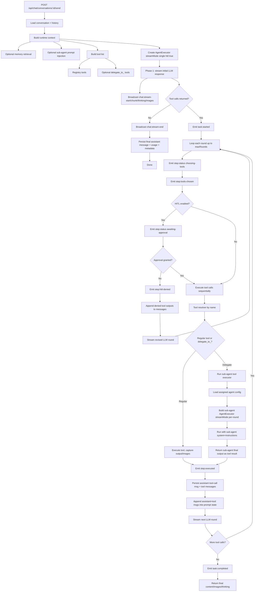
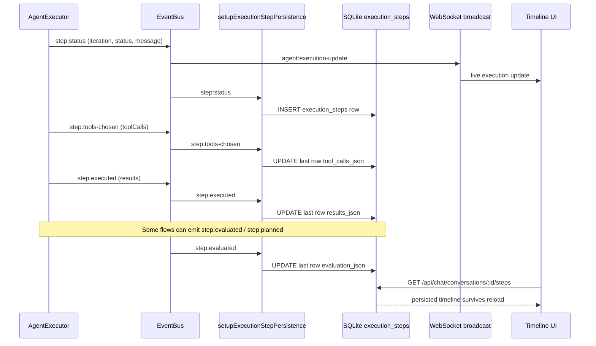
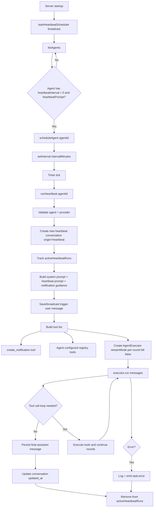
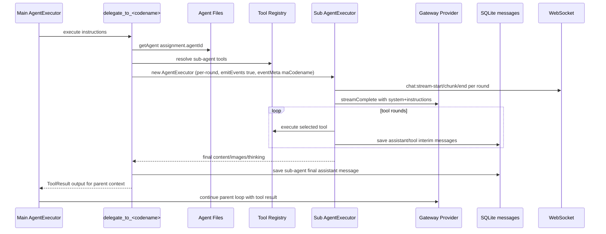

# OpenAgent Execution Diagrams

This document visualizes how agent execution, sub-agent delegation, tools, HITL, telemetry steps, and heartbeat runs work.

## 1) Agent Execution Lifecycle (Chat + Tools + HITL + Sub-Agents)

## 2) Event + Timeline Persistence (Status, Tools, Results, Evaluation)

## 3) Heartbeat Scheduling + Run Lifecycle

## 4) Sub-Agent Delegation Sequence (delegate*to*<codename>)

## Notes

- Chat executions default to streamMode single so one stream id spans rounds with chat:stream-reset between rounds.
- Heartbeat and sub-agent executions use streamMode per-round to create a separate stream id per round.
- HITL approval is enabled in chat executor runs and disabled in heartbeat and sub-agent runs.
- Timeline persistence is event-driven through EventBus listeners that write execution_steps rows.
